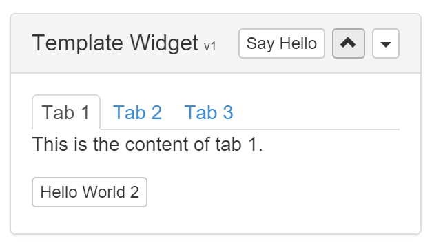

# org-calibrate-widget
Calibrate the machine via metal ring and touch from every side.



## ChiliPeppr Widget / Calibrate

All ChiliPeppr widgets/elements are defined using cpdefine() which is a method
that mimics require.js. Each defined object must have a unique ID so it does
not conflict with other ChiliPeppr widgets.

| Item                  | Value           |
| -------------         | ------------- | 
| ID                    | org-calibrate-widget |
| Name                  | Widget / Calibrate |
| Description           | Calibrate the machine via metal ring and touch from every side. |
| chilipeppr.load() URL | http://raw.githubusercontent.com/99b78fc488c3874b40ecf0df4030a0d2747276aa		branch 'master' of https://github.com/xpix/chilipeppr-calibrate-widget/master/auto-generated-widget.html |
| Edit URL              | http://ide.c9.io/xpix/chilipeppr-calibrate |
| Github URL            | http://github.com/99b78fc488c3874b40ecf0df4030a0d2747276aa		branch 'master' of https://github.com/xpix/chilipeppr-calibrate-widget |
| Test URL              | http://chilipeppr-calibrate-xpix.c9users.io/widget.html |

## Example Code for chilipeppr.load() Statement

You can use the code below as a starting point for instantiating this widget 
inside a workspace or from another widget. The key is that you need to load 
your widget inlined into a div so the DOM can parse your HTML, CSS, and 
Javascript. Then you use cprequire() to find your widget's Javascript and get 
back the instance of it.

```javascript
chilipeppr.load(
  "#myDivWidgetInsertedInto",
  "http://raw.githubusercontent.com/99b78fc488c3874b40ecf0df4030a0d2747276aa		branch 'master' of https://github.com/xpix/chilipeppr-calibrate-widget/master/auto-generated-widget.html",
  function() {
    // Callback after widget loaded into #myDivWidgetInsertedInto
    cprequire(
      "inline:org-calibrate-widget", // the id you gave your widget
      function(mywidget) {
        // Callback that is passed reference to your newly loaded widget
        console.log("My widget just got loaded.", mywidget);
        mywidget.init();
      }
    );
  }
);

```

## Publish

This widget/element publishes the following signals. These signals are owned by this widget/element and are published to all objects inside the ChiliPeppr environment that listen to them via the 
chilipeppr.subscribe(signal, callback) method. 
To better understand how ChiliPeppr's subscribe() method works see amplify.js's documentation at http://amplifyjs.com/api/pubsub/

| Signal | Description |
| ------ | ----------- |
| (No signals defined in this widget/element) |

## Subscribe

This widget/element subscribes to the following signals. These signals are owned by this widget/element. Other objects inside the ChiliPeppr environment can publish to these signals via the chilipeppr.publish(signal, data) method. 
To better understand how ChiliPeppr's publish() method works see amplify.js's documentation at http://amplifyjs.com/api/pubsub/

| Signal | Description |
| ------ | ----------- |
| (No signals defined in this widget/element) |

## Foreign Publish

This widget/element publishes to the following signals that are owned by other objects. 
To better understand how ChiliPeppr's subscribe() method works see amplify.js's documentation at http://amplifyjs.com/api/pubsub/

| Signal | Description |
| ------ | ----------- |
| (No signals defined in this widget/element) |

## Foreign Subscribe

This widget/element publishes to the following signals that are owned by other objects.
To better understand how ChiliPeppr's publish() method works see amplify.js's documentation at http://amplifyjs.com/api/pubsub/

| Signal | Description |
| ------ | ----------- |
| (No signals defined in this widget/element) |

## Methods / Properties

The table below shows, in order, the methods and properties inside the widget/element.

| Item                  | Type          | Description |
| -------------         | ------------- | ----------- |
| id | string | "org-calibrate-widget" |
| url | string | "http://fiddle.jshell.net/xpix/u65oq7up/show/light/" |
| fiddleurl | string | "http://jsfiddle.net/xpix/u65oq7up/" |
| name | string | "Widget / Calibrate" |
| desc | string | "Calibrate the machine via metal ring and touch from every side." |
| options | object |  |
| calibrate | object |  |
| gcodeCnt | number |  |
| originalSteps | object |  |
| mySceneGroup | object |  |
| threedobjects | object |  |
| publish | object | Please see docs above. |
| subscribe | object | Please see docs above. |
| foreignPublish | object | Please see docs above. |
| foreignSubscribe | object | Please see docs above. |
| isInitted | boolean |  |
| init | function | function ()  |
| isRunning | boolean |  |
| getUserData | function | function () |
| onCalibrate | function | function (evt) |
| setProbe | function | function (active) |
| probeResponse | function | function (data)  |
| calculate | function | function (width, height) |
| calibrateComplete | function | function () |
| sendGcode | function | function (gcode) |
| sendGcodeWait | function | function (gcode, callback) |
| receiveLine | function | function (data) |
| setupUiFromLocalStorage | function | function ()  |
| onChiliPepprStateChanged | function | function (state) |
| drawProbe | function | function () |
| get3dObj | function | function ()  |
| get3dObjCallback | function | function (data, meta)  |
| sceneAdd | function | function (obj)  |
| removeAll3DObjects | function | function () |
| sceneRemove | function | function (obj)  |
| showBody | function | function (evt)  |
| hideBody | function | function (evt)  |
| saveOptionsLocalStorage | function | function ()  |
| forkSetup | function | function ()  |


## About ChiliPeppr

[ChiliPeppr](http://chilipeppr.com) is a hardware fiddle, meaning it is a 
website that lets you easily
create a workspace to fiddle with your hardware from software. ChiliPeppr provides
a [Serial Port JSON Server](https://github.com/johnlauer/serial-port-json-server) 
that you run locally on your computer, or remotely on another computer, to connect to 
the serial port of your hardware like an Arduino or other microcontroller.

You then create a workspace at ChiliPeppr.com that connects to your hardware 
by starting from scratch or forking somebody else's
workspace that is close to what you are after. Then you write widgets in
Javascript that interact with your hardware by forking the base template 
widget or forking another widget that
is similar to what you are trying to build.

ChiliPeppr is massively capable such that the workspaces for 
[TinyG](http://chilipeppr.com/tinyg) and [Grbl](http://chilipeppr.com/grbl) CNC 
controllers have become full-fledged CNC machine management software used by
tens of thousands.

ChiliPeppr has inspired many people in the hardware/software world to use the
browser and Javascript as the foundation for interacting with hardware. The
Arduino team in Italy caught wind of ChiliPeppr and now
ChiliPeppr's Serial Port JSON Server is the basis for the 
[Arduino's new web IDE](https://create.arduino.cc/). If the Arduino team is excited about building on top
of ChiliPeppr, what
will you build on top of it?


